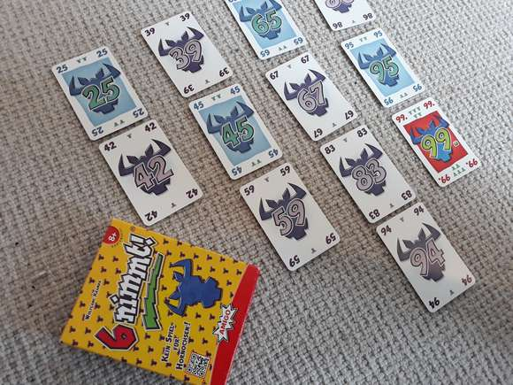
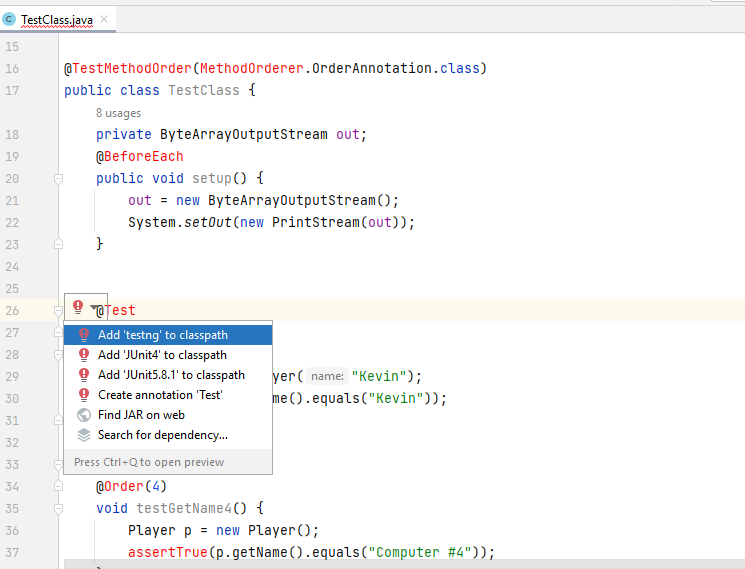
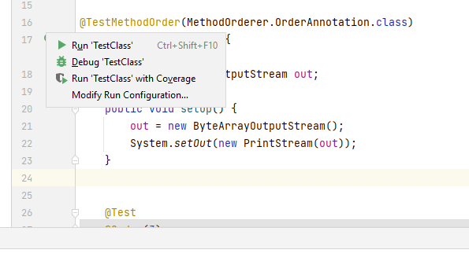
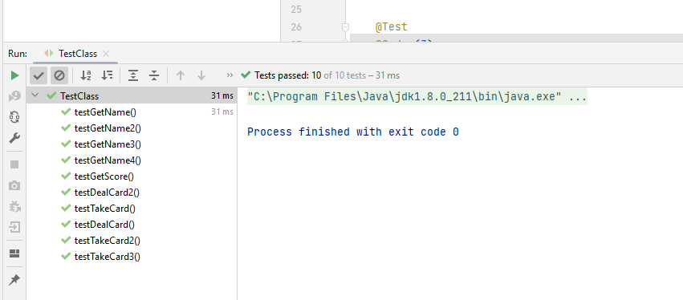
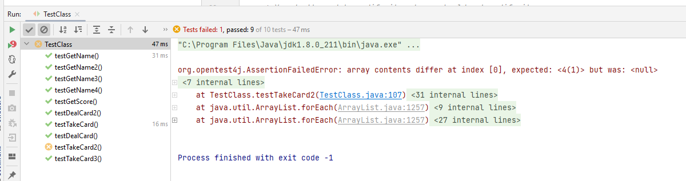

# 6 nimmt (COMP2046 Programming Assignment 2, 2022-23 Semester 1)

# Introduction

As a part of Second Assignment in COMP2046, I completed the boardgame 6 nimmt! There are three main Java files: [Card.java](Card.java), [Player.java](Player.java), [Table.java](Table.java) in this project. A file that is used to test code: [TestClass.java](TestClass.java).
> In this Assignment, we were  not allowed to use any advanced data structure or API such as `ArrayList`, `Arrays`, `List` to manipulate your arrays. We were expected to use just `new` and loops to manipulate arrays. 

# With the help of this Assignment, I learned:

- Creating classes based after understanding the Assignment.
- and practiced using object-oriented programming concepts/static variables/2D arrays/array resizing/method visibility. 
- Using instances of various classes in one program.
- Fixing bugs via unit tests.

# Explanation of the game of 6 nimmt!

image ref: https://boardgamebible.com/games/6-nimmt/

> The rule of the game can be referred to the following links:
> * [YouTube video, in English](https://www.youtube.com/watch?v=ooNfiy6Nfpg)

## Game Rules

* We will assume there are four **players** in this game.
* Each player will be first **dealt with 10 cards** to form their **hand cards**.
* The aim of the game is to minimize the **score** a player received.
* Scores are computed by adding the number of **bull heads** on each card of a player's **score pile (or just "pile")**.
* There are four **stacks** on the table. 
* Each turn player plays their card at the same time. These cards, in ascending order of their **number**, will be compared with the **top card** of each stack. Their card will be placed to the top of a correct stack, so that the **number** of top card of this stack is smaller than the **number** of the played card. In addition, if multiple stacks have top cards smaller than the played card, the stack with the largest top card will be selected.
* Whenever a stack has 6 cards, the player who play the 6th card will need to **move the entire stack** to his score pile.

## Instructions:

- Select a card to play from the ones in your hand.

## `Card` class

This models a card. A card has a unique number `number` and a number of bull heads `bullHead`. The number of bullHead of each card is as follows:
* 1 card with 7 bull heads—number 55
* 8 cards with 5 bull heads—multiples of 11 (except 55): 11, 22, 33, 44, 66, 77, 88, 99
* 10 cards with 3 bull heads—multiples of ten: 10, 20, 30, 40, 50, 60, 70, 80, 90, 100
* 9 cards with 2 bull heads—multiples of five that are not multiples of ten (except 55): 5, 15, 25, 35, 45, 65, 75, 85, 95
* 76 cards with 1 bull head—the rest of the cards from 1 through 104

## `Player` class

This models a player object. A player has a name. A player has a hand of cards (maximum 10 cards) `hand`. The number of card on the player's hand is kept by a variable `handCount`. A player has a score pile of cards `pile`. This variable should be a dynamic array which will automatically resized to fit the number of cards it stores. A player object supports two different way to play a card. It can play a card randomly `playCardRandomly()` or `playCard()`. The latter method will show the hand to the player and ask the player to select a proper card. There are two given methods `printPile()` and `getHandCard(int)`. You should not change any of them or we may not be able to grade your work properly.

## `Table` class

This models the table object. A table contains four stacks of cards `stacks`. Each stack has at most 6 cards. A table has also four Player objects `players`. It controls the main logic of how the game play.

## `TestClass` class

* Designed by professors.

The purpose of this file is to conduct some *unit test* for code. If you are using IntelliJ, you should be able to use this file within a few quick steps. By looking at this file, we have some ideas of how the TA grade work!

1. Open the file `TestClass.java`
2. Click on the word `@Test` at line 26.
   
4. Click the red bulb and select `Add JUnit-5.x.x to classpath`.
5. Click the arrow on the left of `public class TestClass` at line 17 and select `Run Tests`.
  
6. You shall see the following screen if there isn't any problem
  
7. Or you will see some error if your code does not perform what it is suppose to do.
  

--------
* Designed by: [Dr. Kevin Wang](mailto:kevinw@comp.hkbu.edu.hk)
* Assignment Website: [GitHub](https://github.com/khwang0/COMP2026-2223PA1)
