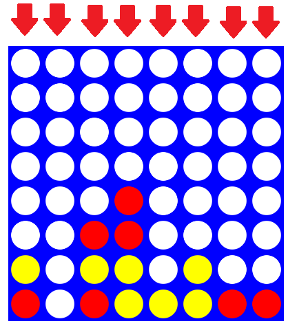

# COMP2026/COMP2045 Programming Assignment 1 - Connect4 (2022-23 Semester 1)

# Introduction

As a First Assignment for COMP2026/COMP2045 (Programming and Problem-Solving; Programming Using Object-Oriented Approach), I designed a Connect 4 Game.
We were given a [sample program](demo.jar) and had to write code which would replicate its behaviour.

> To run the demo program, type the following in your terminal:
> 
> ```sh
> > java -jar demo.jar
> ```

# With the help of this Assignment, I learned:

- The importance of Understanding the task/game and only then starting to code!
- Using basic data structures, such as 1d and 2d arrays, how memory allocation works, method types, etc; practice on parameter passing/method construction.
- Problem-Solving to be able to check for checkmate and check using different scenarios of how the board may be filled.
- Fixing and debugging so the code is clean and understandable.
- Good coding style (choice of parameter/method names).

# Explanation of the game Connect4



<sub><sup>image ref: https://roadtolarissa.com/connect-4-ai-how-it-works/</sup></sub>

It is a grid of 6x8 gameboard where players take turn to drop their block into one of these columns. Their block will reach the bottom by gravity. Whoever player first reaches a line of consecutive four blocks of his/her own symbol wins. The game ends with "Player 2" wins if all holes are filled.

# Instructions

Run the code and follow instructions:
1. Choose two players
2. Each player should choose a symbol or use a pre-assigned (1 and 2)
3. Take turns dropping symbols from the top into a seven-column, six-row vertically suspended grid.
4. The pieces fall straight down, occupying the lowest available space within the column.
5. The goal of the Connect Four game is to be the first player to form a horizontal, vertical, or diagonal line of four of one’s own discs.
6. Connect Four is a solved game. Thus, the first player can always win by playing the right moves.

# Navigation

> Press the following letter + enter for:
1. ‘h’ or ‘H’ for the Help Menu.
2. ‘c’ or ‘C’ to change the symbol. Two players must have different symbols!
3. ‘q’ or ‘Q’ to quit the game. But… come back, we will miss u!
4. ‘r’ or ‘R’ to start the game from scratch. All the progress will be lost and a new empty board will be generated.
- If you don’t need any functions, just play by choosing a column where you want to drop your symbols. Column must be between 0-7. Choose the column that is not full :)

# Some Warnings

1. Check!
   If the player player plays immediately, he/she may end the game. This warns the other player toplace his/her next block in a correct position.
2. Checkmate!
   A check-mate move means no matter how the other player place his/her next block,in the next turn the player can win the game with certain move. A check-mate move must be a check move. Not all check moves are check-mate move.
3. If tie -> board fully filled but no connect 4, Player 2 wins.
- Good luck!!!🙃
------------------
* Assignment Designed by: [Dr. Kevin Wang](mailto:kevinw@comp.hkbu.edu.hk)
* Assignment Website: [GitHub](https://github.com/khwang0/COMP2026-2223PA1)
