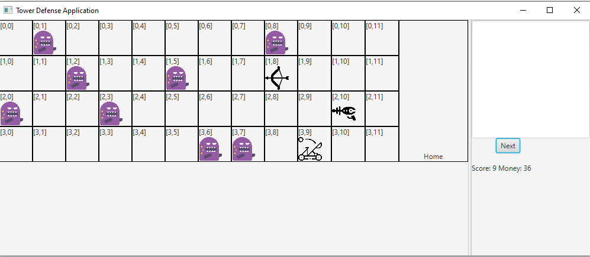

# COMP2026 Programming Assignment 3 - Tower Defense (2022-23 Semester 1)

  

# Introduction

As a part of Assignment Three for COMP2026, I implemented Tower Defense (TD) game following the [sample program](demo.jar) given. 
> In this assignment, I could use any API including `List`, `ArrayList`...


> To run the demo program, type the following in your terminal:
> 
> ```sh
> > java -jar demo.jar
> ```

The file structure is as below:

| Files | Remarks |
|---|---|---|
| `res/*.png` | Graphic for GUI version |
| `Game.java` | The mastermind of the game |
| `Block.java` | Model the generic parent of a Tower/Monster |
| `Tower.java` | Model the generic parent of different towers |
| `Monster.java` |  Model monsters |
| `ArcheryTower.java` | Archery Tower |
| `LaserTower.java` | Laser Tower |
| `CatapultTower.java` | Catapult Tower |
| `Displayable.java` | The interface for display |
| `ConsoleDisplay.java` | For handling user I/O and display content on screen | 
| `GUIDisplay.java` |  For handling user I/O and display content over Graphic User Interface (GUI) |
| `InvalidInputException.java` |  A customer exception class |

# With the help of this Assignment, I learned:

- and practiced object-oriented programming concepts/Inheritance/List/Exception Handling/visibility.
- Understand Polymorphism.
- the basics of GUI.
- Work with many Java files at once.
- Fixing bugs again!

# Explanation of the game Tower Defense

This is a video game that monster will come out on each round. The monster will get stronger and stronger as times goes by. The player starts with some money that can be used to build towers or upgrade towers. These tower will shoot and kill monsters. However, if one monster can escape from the tower's attack and reach the home sign, the game is over. The objective of the game is to get as much point (number of monster killed) as possible. When a monster steps on a tower, the tower will be crashed. 

In each turn, a monster will come out from the first column but a random row. All monsters will move to the right along their row (i.e. monster does not change row). Towers can be built on the grid **except for the first column**.

Most of the game details can be found at the comment of the java file. Good luck!

# Instructions: 

Please pick one of the following: 
1. View a tower/monster
2. Build a new Tower
3. Upgrade a Tower
4. End a turn

------------
* Designed by: [Dr. Kevin Wang](mailto:kevinw@comp.hkbu.edu.hk)
* Assignment Website: [GitHub](https://github.com/khwang0/COMP2026-2223PA3)

